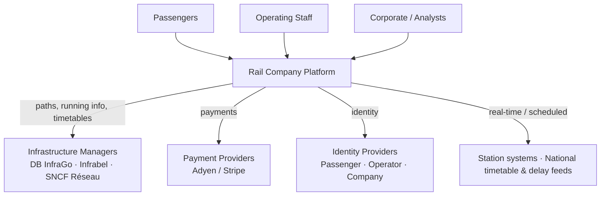
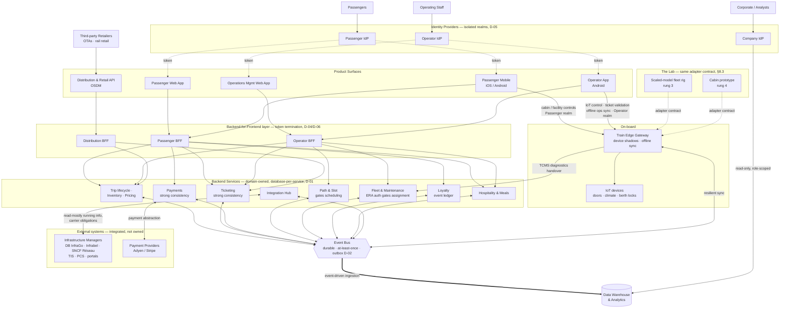

# Rail Company Platform — Target Architecture

_Draft · June 2026_

> **About this document.** This is the canonical architectural description for the platform. It is laid out as a depth ladder: vision and scope first, then the system at a glance, then cross-cutting architecture, then domain-by-domain detail. Decisions that have been made are folded into the domain they belong to and tagged as **Decision Records (D-NN)** so they remain individually traceable and can be easily extracted into a standalone ADR log later. Provide this document at the start of every engineering session.

---

## 1. Vision & Scope

We are building the full technology stack for a greenfield rail company offering both **day trips** (seating-only) and **night trips** (premium seating + beds + suites).

The product philosophy is **transportation meets hospitality**: passengers can book meals, check facility availability in real time, and expect hotel-grade service — all from their devices. The platform provides interfaces for passengers, operators, and fleet.

**Launch scope (working vision — not yet committed).** Our target first route is **Berlin → Cologne → Brussels → Paris**, operating as a **Railway Undertaking (RU)** that purchases track access from three infrastructure managers — DB InfraGo (DE), Infrabel (BE), SNCF Réseau (FR) — under three separate access agreements and operational rulebooks. The Berlin–Paris overnight leg is ~10–11 hours, a natural sleeper duration that would anchor the night-trip product. This is the scenario we design *towards* — it is hypothetical at this stage and used to ground architectural decisions in a concrete operating context. We expect the specifics (route, countries, IMs) to firm up later; the architecture is deliberately built so they can change without re-platforming.

**What is in scope:** passenger booking and experience, operations and crew tooling, the core backend services, fleet and maintenance management, on-board edge compute, rail-infrastructure integration (read-mostly operational data), and analytics. **What is not:** we do not control, replace, implement, or integrate with national signalling (ETCS and national Class B systems) — these live onboard the rolling stock and are operated by the driver and the IM (§6.3, D-15).

---

## 2. Design Principles

These principles lens every decision that follows.

1. **Offline-first, sync-on-reconnect.** Connectivity on moving trains is unreliable. Every on-board system and staff app must function without a live connection and reconcile state when connectivity is restored.

2. **Scale from day one.** No assumptions about fleet size. The architecture must serve a small regional launch and grow to a large international operation without re-platforming.

3. **Cloud-agnostic / Kubernetes-first.** All services are containerised and deployable on any cloud. No hard dependencies on proprietary managed services where avoidable.

4. **Rail infrastructure integration, not ownership.** We integrate **read-mostly** with operational rail data (running information from each IM, plus our onboard-diagnostics handover). Train movement and signalling — ETCS and national Class B systems — remain onboard the rolling stock and are operated by the driver and the IM. We do not control, replace, or build these systems.

5. **IoT abstraction layer.** On-board sensors and hardware (toilets, doors, climate, berth locks) are integrated via a clean adapter layer. No proprietary hardware is owned at this stage; the layer is designed for pluggable off-the-shelf IoT.

6. **Build without the train.** We will not have access to real trains until shortly before trips, for most of the three-year build. No developer or automated agent should ever need real hardware — or any real external system — to build and test a feature. Every external dependency ships with a stable internal contract and a substitutable simulator. _(See §8.)_

---

## 3. System Context

At the highest level, the platform sits between three audiences (passengers, operating staff, corporate/analytics) and a set of external systems we integrate with but do not own.

The reader can stop here and understand the whole: a multi-surface platform for a cross-border Railway Undertaking (RU), integrating with three IMs, external PSPs, segregated identity providers, and national rail data feeds.

---

## 4. Architecture Overview

The platform is composed of eight product surfaces plus on-board edge compute, coordinated through a central event bus.

| Surface | Audience | Role |
|---|---|---|
| Passenger Web App | Consumers | Booking + core trip experience |
| Passenger Mobile Apps (iOS/Android) | Consumers | Facilities, cabin controls, push. Repeat purchases: booking and loyalty. |
| Distribution & Retail API | Third-party retailers (OTAs, rail retailers) | Outbound sales — exposes booking + inventory to external channels (OSDM) |
| Operations Management Web App | Ops, planners, CS | Full trip lifecycle management |
| Operator App (Android, phone/tablet) | On-board & ground staff | Role-based on-board operations |
| Backend Services | (no UI) | Domain-owned business logic & data |
| Data Warehouse & Analytics | Execs, commercial, data | Reporting & forecasting |
| Train Edge Gateway | On-board | Local compute, IoT, offline sync |
| The Lab | Engineering | Physical, contract-conformant testbed — scaled-model fleet rig + cabin prototype (§8.3), proving offline sync and the IoT adapter against the same contracts as production |

The diagram below shows how the surfaces, backend domains, on-board edge, external systems, and the Lab fit together. The recurring shape is the same throughout: external tokens terminate at a per-surface BFF (D-06), each BFF talks to domain services that own their data (D-01), and services coordinate over the durable event bus rather than reaching into each other's stores.

### 4.1 Communication & integration patterns

Some of these are structural decisions (tagged below); the rest are construction guidelines.

- **Internal service-to-service:** event-driven (Kafka/NATS) as the backbone, with synchronous REST/gRPC where a request/response is genuinely needed.
- **Service-owned source of truth (database-per-service):** each domain service is the sole authority for its own data — orders owns orders, inventory owns seats/berths/meal slots, loyalty owns points. No service reads another's database directly; cross-service data is obtained via that service's API or by subscribing to its events. The event bus is a **transport for notifications between services, not a store and not a source of truth.**
- **Client real-time:** WebSocket / Server-Sent Events for live updates (trip status, facility state, meal status). _(Guideline.)_
- **Client queries:** GraphQL via a **Backend-for-Frontend (BFF)** layer, one per client surface.
- **Deployment:** Kubernetes, all services containerised, Helm-based config, GitOps (ArgoCD or Flux).
- **Observability:** OpenTelemetry traces, structured logging, metrics via Prometheus + Grafana. _(Guideline.)_

> **Decision D-01 (Resolved, Jun 2026):** Event-driven (pub/sub) backbone with **per-service data ownership (database-per-service)**: each domain service is the source of truth for its own domain and publishes domain events for others to consume. Synchronous REST/gRPC only where request/response is genuinely needed. The bus is transport, not a system of record.
> _Rationale:_ aligns the source of truth with the bounded domains in §6, keeps each domain's consistency model its own (strong where needed, eventual elsewhere), and is simpler to staff and reason about than platform-wide event sourcing. _Constraint:_ the bus must be **durable and at-least-once**, and all consumers must be **idempotent** — a transient fire-and-forget bus is not acceptable. _Escape hatch:_ broker vendor is replaceable (Kafka, NATS/JetStream, or equivalent); the pattern is fixed. _Starting shape:_ a modular monolith with one schema per domain and hard module boundaries satisfies this — services can be extracted later without changing the ownership model.

> **Decision D-02 (Resolved, Jun 2026):** Reliable event publishing via the **transactional outbox** pattern (or CDC off the database log): a service writes its domain event to an outbox table inside the same DB transaction as its state change, and an asynchronous relay publishes it to the bus.
> _Rationale:_ a service commit and a bus publish are not atomic; a naïve dual write will sometimes lose events (committed, not published) or emit phantom events (published, then rolled back). The outbox makes publication a consequence of the commit, so events and state never diverge. _Implication:_ consumers must be idempotent (D-01) since at-least-once delivery means events can repeat. Cross-service flows that span multiple owners (e.g. the split base/hospitality payment, §5.2) use **sagas / choreography**, not distributed transactions.

> **Decision D-03 (Resolved, Jun 2026):** Cloud-agnostic, Kubernetes-first, GitOps-managed (ArgoCD or Flux); no hard dependency on proprietary managed services.
> _Rationale:_ portability and multi-cloud optionality. _Tradeoff accepted:_ we forgo some managed-service convenience to avoid lock-in — a deliberate cost, not a free default.

> **Decision D-04 (Resolved, Jun 2026):** Client queries via GraphQL behind a Backend-for-Frontend layer, one BFF per surface.
> _Rationale:_ each surface gets a tailored, evolvable contract without bloating a shared gateway. _Alternatives considered:_ shared REST gateway (rejected — couples surfaces).

---

## 5. Cross-Cutting Architecture

These concerns span every surface. Each carries a made decision, folded in here because it governs the whole platform rather than any single domain.

### 5.1 Identity & Access

Three completely separate Identity Providers with hard domain separation. **No cross-realm token acceptance under any circumstance.**

- **Passenger IdP** — passenger app (web + mobile) only. Login via email/password, Google, Apple, and eIDAS-compliant government identity schemes (iDIN, BankID, FranceConnect, UK Verify). A proudly European identity posture — government ID support is a brand differentiator. GDPR subject rights (export, deletion) are first-class. MFA offered, not mandated.
- **Operator IdP** — all staff-facing apps. Email login, **MFA mandatory**. Accounts provisioned/deprovisioned by HR ops. Tokens cached on the Train Edge Gateway, valid for full trip duration without a live IdP connection. The Operator App **also caches its own trip-duration session on the device** (token + operator-realm JWKS), so a conductor can authenticate and validate tickets when the device is offline from both the cloud and the edge (§6.2); MFA is satisfied at shift start, then offline for the trip. Roles: conductor, cleaner, controller, catering, on-board host.
- **Company IdP** — corporate SaaS only (Google Workspace, Slack) plus **read-only, role-scoped** access to the Data Warehouse. Does **not** connect to any operational surface. Implemented on whatever the client runs corporately (Google Workspace Identity or Azure AD).

**Authentication topology.** The three realms govern *where users authenticate*; they are kept isolated by terminating every external IdP token at the edge, so that no Backend Service ever consumes more than one issuer.

- Each external IdP token is validated and **terminated at the per-surface BFF** (D-04): the Passenger BFF accepts Passenger-realm tokens only, the Operator BFF accepts Operator-realm tokens only. The external token does not travel further inward.
- The **Backend Services live in a single internal trust domain.** They never consume Passenger/Operator/Company IdP tokens. Service-to-service calls authenticate by workload identity (mesh mTLS / SPIFFE), and the end-user is carried inward via **token exchange (RFC 8693)**: each BFF exchanges the validated external token for an internal token minted by one internal issuer. A Backend Service validates exactly one issuer — the internal one — and reads `realm` and scopes as **claims** used for authorization. Realm separation is therefore an *authentication-boundary* property: a single service (e.g. bookings) may legitimately serve a passenger asking for "my booking" and an operator asking for "the manifest" under different scopes, without ever accepting a cross-realm token.
- The **Train Edge Gateway is a second multi-realm boundary**: the Passenger App reaches it directly for cabin/facility controls (Passenger realm, §6.1) while operator tokens are cached on it for offline operation (Operator realm). It applies the same rule — per-realm validation at each entry path, including **offline** (cached JWKS for operator tokens; a defined offline-validation story for passenger tokens) — then uses internal identity behind.

> **Decision D-05 (Resolved, Jun 2026):** Three isolated IdPs with hard realm separation; the DW analytics boundary is enforced via the Company IdP only.
> _Rationale:_ blast-radius isolation between passenger, staff, and corporate domains; analysts never touch production. _Alternatives considered:_ single IdP with role scoping (rejected — insufficient isolation). _Auth topology:_ see D-06 — external tokens terminate at the BFF/edge and Backend Services trust a single internal issuer, so this rule holds literally at every component.

> **Decision D-06 (Resolved, Jun 2026):** External IdP tokens are validated and terminated at the per-surface BFF (and at the Train Edge Gateway for its direct paths); Backend Services sit in one internal trust domain, reached via **token exchange** into a single internal issuer, with service-to-service auth by workload identity (mTLS / SPIFFE). Realm is carried inward as a **claim** for authorization, never as a cross-realm token.
> _Rationale:_ lets one service serve multiple realms under different scopes while keeping D-05's no-cross-realm-acceptance rule literally true at every component — the realm is data inside an internal token, not a foreign token crossing a boundary. _Edge case:_ the gateway must validate each realm **offline**, which constrains token lifetimes and requires cached JWKS for the operator realm and an explicit offline story for the passenger realm.

### 5.2 Payments

- **Primary PSP:** Adyen — European acquiring breadth, unified commerce (online + terminal + kiosk), rail/hospitality references.
- **Fallback PSP:** Stripe, if the client mandates. A **payment abstraction layer** keeps the PSP swappable per market.
- **Currency:** full multi-currency from day one; Adyen handles local-currency settlement.
- **Split payment model:** base ticket charged at booking; mid-trip hospitality spend (meals, upgrades) handled via pre-authorisation or post-trip charge. This is a non-trivial flow requiring explicit design.

> **Decision D-07 (Resolved, Jun 2026):** Adyen primary, Stripe fallback, behind a per-market payment abstraction layer; multi-currency from launch.
> _Rationale:_ European-first acquiring + unified commerce; abstraction de-risks PSP lock-in. _Open design item:_ the split base/hospitality payment flow.

### 5.3 Data Residency & Regulatory

Compliance is architectural here, not a feature bolted on later.

- **Primary frameworks:** GDPR (DE, BE, FR).
- **PNR (national-law-dependent, behind an interface):** the EU PNR Directive (2016/681) mandates PNR collection from **air carriers only** — rail is outside the mandatory EU scope. Some member states extend PNR-style collection to rail under national law (France is the candidate to confirm on this route). We therefore design a **PNR capability behind an interface** — a segregated store with controlled retention and a competent-authority request interface — but **activate it per market only where national law requires it**, pending legal advice. This is a legal determination, not an architectural one. _(Treated as a per-market seam, not a day-one build — see §7.)_
- **TSI PRM (accessibility):** the passenger seat/berth selection UI must be compliant from day one. Flagged to the UX workstream early.
- **Data residency:** EU/EEA clusters only — no data leaves the EEA.

> **Decision D-08 (Resolved, Jun 2026):** EU/EEA-only data residency and TSI PRM compliance are designed in from day one and load-bearing. **PNR is downgraded to a national-law-dependent, per-market seam** — a capability behind an interface, activated only where a member state's law requires it, pending legal advice.
> _Rationale:_ data residency and TSI PRM are legally non-reversible and cannot be retrofitted, so they stay day-one. PNR, by contrast, is **not** mandated for rail under the EU PNR Directive (air carriers only); building a non-deferrable segregated PNR subsystem would over-engineer against an obligation that may not bind us. _Status:_ residency + TSI PRM load-bearing; PNR protected by an interface, deferred to per-market activation (§7). _Depends on launch route (§1):_ a future non-Schengen or UK route could reintroduce border/PNR and UK data-residency requirements — the PNR interface is kept precisely so that activation is config, not re-platforming. _Caveat:_ confirm PNR applicability with counsel per market (France first).

### 5.4 Multi-tenancy & multi-country

A tenant-aware service layer with per-country compliance configuration (data residency, rail regulations). This supports the "scale from day one" principle without per-country forks of the codebase.

> **Decision D-09 (Resolved, Jun 2026):** A single multi-tenant, tenant-aware codebase with per-country compliance configuration — not per-country deployments or forks.
> _Rationale:_ one platform scales to new countries via config, not code branches. _Alternatives considered:_ per-country deployments (rejected — operational and maintenance multiplier).

---

## 6. Product Surfaces

One subsection per product surface — the distinct digital products we build (plus the Backend Services that sit behind them). Where a decision has been made for a surface, it is woven in and tagged.

### 6.1 Passenger Experience

**Web app (consumer-facing).** Trip search, booking, seat/berth selection, payment; real-time trip status (delays, platform, next stops); in-trip hospitality (dinner, breakfast, snacks, drinks); loyalty/profile. _Offline:_ ticket/booking data cached locally; real-time features degrade gracefully.

**Mobile apps (iOS + Android).** Connect to the internet for most features and **directly to the Train Edge Gateway** for cabin and facilities controls: facility availability (toilet busy/free, lounge occupancy), cabin/berth controls for night trips (lighting, temperature), push notifications (departure alerts, meal ready, service updates). Can also offer booking and loyalty features for returning customers.  _Offline:_ ticket/booking data cached; edge-gateway-dependent features work offline, other features degrade gracefully.

**Distribution & Retail API (third-party sales).** Our own web and mobile apps are first-party channels; they are not the whole market. Most of the addressable audience for a new cross-border sleeper reaches us through third-party retailers — OTAs (Trainline, Omio), incumbent rail-retail channels, and corporate/travel-agency distribution. This surface is the **outbound sales channel**: a B2B API, not a human-facing UI, that exposes the same booking and inventory backend (§6.3) to external retailers under controlled, channel-scoped terms.

- **Standards posture:** conform to **OSDM** (Open Sales and Distribution Model) — the rail sector's emerging offer/booking/fulfilment standard — so retailers integrate against an industry contract rather than a bespoke one, enabling offers, booking, fulfilment, and through-ticketing.
- **Capabilities:** offer/search, availability and price, booking and fulfilment (ticket issuance), and post-sale (exchange/refund) — all reading the same inventory and pricing domains the first-party apps use, so channels never see a divergent product.
- **Channel governance:** per-channel identity, scopes, rate limits, and **commission/fare-distribution terms**; channel attribution flows through to the revenue/finance domain (settlement and reconciliation per channel).
- **Consistency:** inventory holds and ticketing are strongly consistent (D-11) regardless of channel — a third-party sale cannot double-book against a first-party sale.

> **Decision D-20 (Resolved, Jun 2026):** Third-party distribution is a first-class product surface — an **outbound, OSDM-conformant Distribution & Retail API** exposing the shared booking/inventory/pricing backend to external retailers under per-channel governance, not a separate sales stack.
> _Rationale:_ first-party-only sales leaves most of a new RU's addressable market unreachable; modelling distribution as a thin surface over the same domains keeps one source of truth for inventory and price across all channels, and OSDM avoids bespoke per-retailer integrations. _Tradeoff accepted:_ OSDM conformance and channel governance are real build cost. _Depends on:_ a revenue/finance domain for per-channel settlement and commission (open — flagged for a later session). _Boundary:_ this surface sells; it does not own inventory, pricing, or ticketing — those remain backend domains (§6.3).

### 6.2 Operations & Crew

**Operations Management Web App** (ops managers, fleet/trip planners, customer service):
- Pre-trip: schedule management, resource assignment, staff rostering
- Path & slot management: held-path registry and validity, with PCS / IM-portal workflow status; path gating surfaced to the trip scheduler (see Backend Services, §6.3)
- During trip: live train tracking, incident management, real-time passenger manifest, in-trip retail services (e.g. an on-board fidget-toy shop)
- Post-trip: delay logging, service-quality reports, feedback aggregation
- Train configuration per trip type (day vs night layout)
- Integration view into rail-infrastructure signals and timetables

**Operator App** (conductors, controllers, cleaners, catering, on-board hosts; **Android** phone + tablet):
- Role-based dashboards (a conductor sees different things to a cleaner)
- Passenger manifest and seat/berth map
- Ticket validation (QR / NFC) — edge-first, reconciled (§6.4). The app **pre-loads the full trip manifest and validation rules to the device** at trip start, so once downloaded it validates any ticket for that trip with no cloud — and no edge — dependency. The on-device manifest is the **availability floor** (validation is never blocked by connectivity); the edge, when reachable, still coordinates scans for real-time double-scan prevention.
- Task lists: cleaning schedules, turnover checklists
- Meal service management: order queue (fed by passenger orders, §6.3 Hospitality), delivery status — served by the edge first, reconciled to the Hospitality service in the background (§6.4)
- Cabin & facility device control (Operator realm, broader scope than passengers): set up or override berth/suite environment, read operational device state (door, cleaning completion, supply levels) — directly against the Train Edge Gateway (§6.4)
- Incident and fault reporting; messaging with the operations centre
- **Critical requirement:** full offline functionality. State syncs to the Train Edge Gateway when possible, and to the cloud when the train has uplink.

> **Decision D-10 (Resolved, Jun 2026):** The Operator App is **Android-only** (phone + tablet), on corporate-issued, MDM-managed devices. No iOS, no BYOD for staff.
> _Rationale:_ a single platform shrinks the build/test/conformance surface (§8), staff devices are company-provisioned so no consumer-platform breadth is needed, and rugged Android hardware fits an on-board/depot environment. Pairs with the Operator IdP (mandatory MFA, HR-provisioned, edge-cached tokens — §5.1). _Tradeoff accepted:_ tied to the Android device ecosystem. _Note:_ passenger apps remain iOS + Android (§6.1) — this decision is staff-surface only.

### 6.3 Backend Services

The Backend Services are the authoritative, **no-UI business-logic layer** behind every surface — organised as **domain-owned modules/services, each the source of truth for its own domain** (database-per-service, D-01). A modular monolith with one schema per domain is an acceptable starting shape; services can be extracted later without changing the ownership model. Each module owns its data and publishes domain events to the bus via the transactional outbox (D-02); no module reads another's store directly. An **integration hub** fronts external systems — payment processors, station systems, and the national rail infrastructure (detailed under *Rail-infrastructure integration* below).

The Backend Services own the following domains.

**Trip lifecycle, inventory & pricing.**

- **Trip lifecycle engine:** creation, scheduling, boarding, completion, cancellation
- **Inventory management:** seats, berths, suites, meal slots, linen allocation
- **Pricing and yield engine**
- **Crew and staff assignment**
- **Hospitality & meals:** order capture, galley/kitchen queue, preparation and delivery status for in-trip food and drink — surfaced through the passenger and operator apps (§6.1–6.2)

**Hospitality order flow — edge-first.** A passenger places hospitality orders (a meal now, breakfast for tomorrow) from their app; the operator app shows them as a fulfilment queue. Routing follows the edge-first precedence (§6.4), but the **Hospitality service stays the source of truth** throughout (D-01) — the edge never owns order state, it only buffers it.

- *In-trip (edge reachable — the normal on-board path):* order → **Train Edge Gateway** (primary) → brokered locally to the operator app, so passenger and crew stay in sync whether or not the train has uplink; the edge syncs the order to the Hospitality service in the background — for persistence, payment, and loyalty — under the §7 conflict model (HIGH RISK).
- *Edge unreachable, backend reachable:* order → Hospitality service directly (fallback); the service **back-syncs it to the edge once the edge reconnects**, so the on-board queue catches up.
- *Pre-trip (off-board):* order → Hospitality service normally, then **pre-loaded onto the edge gateway before departure**, the same way manifest and tickets are (§6.4).

_Privacy boundary: meal orders persist — they are payment and loyalty events — distinct from facility-occupancy state, which is real-time only and never persisted (§6.4, D-17)._

> **Decision D-11 (Resolved, Jun 2026):** Eventual consistency is the default *across* domains; **strong consistency is required within the payments and ticketing services.**
> _Rationale:_ availability and offline tolerance everywhere except where double-booking or double-charging is unacceptable. _Implication:_ ticketing and payment paths cannot quietly relax to eventual consistency for performance — that boundary is deliberate. _Mechanism:_ each owns a strongly-consistent transactional store (D-01); strong consistency is a property *inside* a service, not across the bus. Multi-service flows (e.g. split payment, §5.2) coordinate via sagas, not distributed transactions (D-02).

**Path & slot management.** A path (slot) is the fundamental operating right — without one, a trip cannot run. Paths are therefore a first-class domain whose state **hard-gates trip scheduling**, in the same way maintenance and certification do (D-13).

- **Path registry:** each held path recorded with its IM, validity window, working-timetable period (annual vs ad-hoc), and linkage to the trip(s) it enables.
- **Workflow-status mirror:** requested → offered → allocated → held → withdrawn, mirroring the state of the external request in **PCS** / the IM's national process.
- **Trip gating:** a trip can only be scheduled against a held, valid path for that date and IM; the scheduler enforces this as a hard rule.
- **Boundary:** the platform is the **record of truth** for paths we hold and their linkage to trips. The *requesting and negotiation* happen externally in PCS and the national IM portals (§6.3, Rail-infrastructure integration) — we do not build a path-request or path-optimisation engine.

> **Decision D-12 (Resolved, Jun 2026):** Path lifecycle management is a Backend Services domain (registry + workflow-status mirror) surfaced through the Operations web app; held-path state hard-gates trip scheduling. PCS and the national IM portals are the external system of record for the request/negotiation workflow.
> _Rationale:_ paths are an operating prerequisite on par with certification and maintenance; modelling them as a first-class gate prevents scheduling trips we have no right to run. _Scope guard:_ registry and gating only — no in-house path-request or optimisation engine (that lives upstream in PCS/IM systems).

**Fleet & maintenance.** Company-owned rolling stock, with full asset lifecycle in the Backend Services.

- **Fleet Registry:** each train a versioned asset with full configuration history; carriage composition (order + seats/berths/suite); day-config vs night-config templates with a managed transition workflow.
- **Maintenance Module:** scheduled calendar (manufacturer intervals + regulatory checks); unscheduled maintenance from operator fault reports or IoT alerts; maintenance state **gates trip assignment** (a train in depot cannot be scheduled); workshop/depot management; parts and inventory per depot.
- **Compliance Tracking (vehicle-level):** vehicle authorisation via the **ERA one-stop shop** (Fourth Railway Package) — a single authorisation per train scoped to an **area of use** (the set of networks, e.g. DE + BE + FR), carrying **per-network conditions of use** rather than separate per-country homologations. The registry tracks the authorisation, its area of use, conditions, and a single expiry/renewal per train; expired/missing or out-of-area-of-use authorisation **automatically blocks trip assignment**; renewal workflows surfaced to the ops app. (Onboard CCS conformance per network is the rolling-stock concern in D-15.)
- **Compliance Tracking (RU-level — Single Safety Certificate):** the carrier's own operating credential. ERA's one-stop shop issues a **Single Safety Certificate (SSC)** authorising the RU to operate across its **area of operation** (DE + BE + FR), replacing the old per-country safety certificates — the RU-level counterpart to per-train vehicle authorisation. The platform tracks the SSC, its area of operation, conditions, and a single expiry/renewal. An expired, missing, or out-of-area SSC is a **network-wide scheduling gate** (no SSC for a network → no trip may be scheduled over it, regardless of which train is assigned), distinct from the per-train vehicle-authorisation gate; renewal surfaced to the ops app. _Note:_ the SSC is an RU credential, not a rolling-stock asset; it lives here so all regulatory gating is tracked in one domain, but it gates by network/area of operation, not by vehicle.
- **Turnaround Workflow:** night-train turnaround (arrival → next departure) is operationally critical and time-constrained. The system models the full sequence — cleaning, linen change, restocking, maintenance checks, reconfiguration — connected to the Operator App (task assignment) and the trip scheduler (minimum turnaround time enforced as a **hard rule**).

> **Decision D-13 (Resolved, Jun 2026):** Company-owned fleet; full asset lifecycle, maintenance, and authorisation/compliance live in the Backend Services. Two ERA one-stop-shop instruments hard-gate operation: **vehicle authorisation** (one per train, scoped to an area of use with per-network conditions — Fourth Railway Package) gates **trip assignment** per train, and the **Single Safety Certificate** (one per RU, scoped to an area of operation) gates **scheduling per network**. Maintenance state also hard-gates trip assignment.
> _Rationale:_ safety and regulatory blocking must be systemic, not procedural — and the two ERA instruments fail differently, so the platform models both gates. _Correction:_ authorisation is a single ERA one-stop-shop instrument over an area of use, not N independent per-country homologations; the data model and renewal workflow follow that shape, while per-network conditions of use are retained. The SSC is the RU-level analogue and is tracked alongside it.

**Loyalty.** Built in-house, with full ownership of accrual, redemption, tiers, and member data.

- **Event-ledger architecture:** every accrual event (ticket booked, meal ordered, suite upgrade, trip completed) is stored as an immutable event with a points value. **Balance is always derived, never stored** — enabling retroactive rule changes and a rich behavioural dataset for the warehouse. _Note:_ this event-sourcing is **internal to the loyalty service** — its way of being the source of truth for its own domain (D-01). It is not a platform-wide pattern; other domains keep their own stores in whatever shape suits them.
- **Tier model:** Bronze/Silver/Gold via a configurable rule engine (not hardcoded); night-trip spend weighted more heavily given hospitality margin.
- **Redemption scope:** on-platform only at launch (seat upgrades, meal credits, suite access); the data model extends to partner redemption without restructuring.
- **Member identifiers:** portable; cross-operator interoperability not in scope for launch but not precluded.

> **Decision D-14 (Resolved, Jun 2026):** In-house loyalty on an immutable event ledger with derived balances and a configurable tier rule engine.
> _Rationale:_ retroactive flexibility + analytics value; avoids stored-balance reconciliation bugs.

**Rail-infrastructure integration.** We are an RU purchasing track access from three IMs — **DB InfraGo (DE), Infrabel (BE), SNCF Réseau (FR)** — under three separate access agreements and rulebooks. Our integration surface with the rail network is deliberately small and **read-mostly**: we consume operational data and meet our carrier obligations to each IM, but we do **not** build, own, or operate any train-movement system.

**Explicitly out of scope — train movement.** Signalling, movement authority, ETCS, and the national Class B systems each network requires (e.g. PZB/LZB in Germany, TBL1+/Crocodile in Belgium, KVB/TVM in France) live **onboard the rolling stock**. They are type-approved, vendor-supplied, and operated by the driver in conjunction with the IM's traffic control. The platform implements none of this. This is a rolling-stock procurement and authorisation concern, not a software one.

- **System handover (rolling stock → platform):** the train is commissioned and handed over by the vendor. The one data path inward is a **read-only handover of onboard diagnostics (TCMS)** — fault and condition data feeding the maintenance/fleet domain (§6.3, Fleet & maintenance). This is a handover from the train, not a network integration.
- **Operational running information (read-only, per IM):** delay, running forecast, and disruption data — the carrier↔IM exchange defined by **TAF/TAP TSI**, consumed in practice via RNE's **Train Information System (TIS)** for international running. Normalised to a unified internal model and surfaced to ops and passengers. (NeTEx/SIRI are the CEN standards for downstream **passenger-information distribution**, relevant later — not the operational handshake with the IM.)
- **Carrier obligations to the IM (via IM web portals):** path requests and **train-preparation / composition reporting** (the "train ready" TAF/TAP obligations) are transacted through each IM's web portal and RNE's **PCS** for path coordination. At launch these are **portal-driven from the Operations web app within the trip lifecycle** (§6.2); they move to API automation only when route volume makes the manual path untenable. See *Path & slot management* (§6.3) for the domain that holds this state.
- **Adapter layer:** one connector per IM, all normalising to a **unified internal operational-data model**, wrapped with circuit breakers, fallback caching, and versioned contracts. The adapters are **read-mostly** — operational data in, no movement or control out. We are not coupled to upstream formats.

> **Decision D-15 (Resolved, Jun 2026):** Train movement, signalling, and the onboard CCS stack (ETCS + national Class B systems) are **out of platform scope**. Rolling stock is vendor-commissioned and handed over; the platform integrates read-only operational data plus a read-only onboard-diagnostics (TCMS) handover.
> _Rationale:_ these are safety-of-life, type-approved systems we neither own nor build; treating them as platform scope points engineering at a domain owned by the rolling-stock vendor, the driver, and the IM. _Tradeoff accepted:_ we depend on the vendor's diagnostic interface for the handover. _Boundary:_ the platform's rail integration is read-mostly — operational data in, never control out.

> **Decision D-16 (Resolved, Jun 2026 · amended):** One normalising **read-mostly** adapter per infrastructure manager, over a **unified internal operational-data model** with circuit breakers, fallback caching, and versioned contracts. Inbound: TAF/TAP TSI running information (via TIS). Carrier obligations (path requests, train preparation) transacted via IM web portals / PCS. No signalling or movement data is consumed or produced.
> _Rationale:_ insulates the platform from three divergent upstream interfaces and from upstream outages, while keeping the surface read-mostly (D-15). _Depends on launch route (§1):_ the specific IMs and their portals/feeds follow from the Berlin–Paris premise; the adapter-per-IM pattern holds regardless, but the connectors themselves change if the route changes.

### 6.4 On-Board / Train Edge & IoT

Each train runs a **Train Edge Gateway** — a hardened local compute node (small server or industrial PC).

- Hosts the on-board **IoT adapter layer** (toilet sensors, door state, berth controls, climate)
- Serves the passenger Wi-Fi portal and proxies real-time requests when uplink is available
- Maintains a local event log that syncs upstream when connected (4G, 5G, or satellite)
- Communicates with the Backend Services via a **resilient sync protocol** — not simple REST; conflict resolution is required _(protocol and conflict-resolution model still open — see §7, flagged HIGH RISK)_
- **Two client realms reach the gateway directly:** the passenger app for cabin/facility controls (Passenger realm) and the operator app for ticket validation, IoT control, and operational sync (Operator realm) — each validated per-realm, including offline (D-06)
- **Store-and-forward for on-board operations:** brokers on-board operations locally — ticket validation, in-trip hospitality orders, operational state — between the passenger and operator apps, reconciling them into the owning Backend service in the background. The edge is a buffer, not a source of truth — domain authority stays with the owning service (D-01)
- **Connectivity:** 4G/5G primary, satellite fallback (future phase), local mesh between carriages where applicable; all critical state (manifest, tickets, pre-trip hospitality orders) pre-loaded before departure

**Connectivity precedence — edge-first.** For any capability the edge serves — cabin/facility control, on-board ticket validation, manifest and operational state, in-trip hospitality orders — on-board apps talk to the **edge first whenever it is reachable**, and fall back to the Backend Services only when the edge is not. The edge syncs to the backend in the background; conversely, when an app reached the backend directly because the edge was down, the backend **back-syncs to the edge once the edge reconnects**, so the two never stay divergent. Cloud-only capabilities (search, booking, payment, pricing, loyalty) always use the backend — the edge has no role there. Precedence is therefore **edge → backend → on-device local**, with the Backend Services remaining the source of truth (D-01) and the strong-consistency anchor for ticketing and payments (D-11); on-board operation while partitioned from the backend is optimistic and reconciled (§7). For ticket validation specifically, the operator device holds its own pre-loaded manifest (§6.2), so **on-device local is a designed availability floor** — the app validates with neither edge nor cloud — not a degraded last resort; the edge is still preferred when reachable, for real-time cross-device coordination.

**IoT abstraction layer.** A **Device Shadow** model on the edge gateway — each device has a shadow document with reported (actual) and desired (target) state; the gateway reconciles. Works offline natively; a pluggable adapter interface keeps business logic out of vendor-specific code. **Hardware vendor selection is a future phase.** Facility state (toilet occupied, lounge availability) is **real-time only, never persisted** — an explicit passenger-privacy boundary.

IoT surface by category:
- **Facility state** (read, broadcast): toilet occupied/free, lounge occupancy, dining-car availability
- **Environment control** (read/write, scoped to berth/suite): lighting, temperature, berth privacy lock — passengers control their own berth/suite; operators (host/conductor) act across berths/suites and may override (Operator realm, §6.2)
- **Operational state** (read, staff/ops): door state, cleaning completion, supply inventory
- **Onboard diagnostics (TCMS):** train fault/condition data, received via the vendor handover (D-15) and fed to maintenance — distinct from the IoT layer
- **IM running information:** delay/forecast/disruption, sourced from the rail-infrastructure adapter (TAF/TAP TSI via TIS), not the IoT layer and not from onboard signalling

> **Decision D-17 (Resolved, Jun 2026):** Device Shadow IoT pattern on the edge gateway behind a pluggable adapter; offline-native control; facility state never persisted. Hardware vendor deferred (see §7).
> _Rationale:_ offline-first device control + privacy by design; the adapter contract is exercised first by the prototype cabin (§8).

### 6.5 Data Warehouse & Analytics

For executives, commercial team, operations analysts, and data scientists.

- **Capabilities:** operational KPIs (punctuality, occupancy, revenue per seat/berth); hospitality analytics (meal uptake, facility-usage patterns); passenger behaviour and booking funnels; fleet health and maintenance patterns; demand forecasting for pricing and scheduling.
- **Architecture:** event-driven ingestion from the operational event bus → staging → modelled data mart → BI layer (Metabase, Superset, or Looker). **Separate from OLTP; no direct DB queries against production.** Access is via the Company IdP, read-only and role-scoped (see §5.1).

---

## 7. Deferred Decisions & Open Seams

Intentionally unresolved. Most are protected by an interface designed now, so the implementation can be chosen later without rework. The two **HIGH RISK** items are different — they are not yet protected by a settled design, and they underpin offline-first (principle #1). They must be resolved early, not late.

| Seam | Status | Protected by |
|---|---|---|
| Offline conflict resolution — CRDT vs event-log-based | **Open — HIGH RISK** | Not yet settled (edge sync, §6.4) |
| Edge↔backend resilient sync protocol | **Open — HIGH RISK** | Not yet settled (edge sync, §6.4) |
| Split payment flow (pre-auth vs post-trip charge for hospitality) | Open — design needed | Payment abstraction layer (§5.2) |
| IoT hardware vendor selection | Deferred | Pluggable adapter contract (§6.4) |
| Satellite uplink | Future phase | Connectivity strategy (§6.4) |
| PNR collection — applicability per market | Deferred — national-law-dependent (confirm with counsel; France first) | PNR capability behind an interface (§5.3, D-08) |
| Revenue / finance domain — per-channel settlement, commission, VAT | Open — design needed | Required by the Distribution & Retail API (§6.1, D-20); not yet a defined backend domain |
| Partner loyalty redemption | Post-launch | Loyalty data model (§6.3) |
| Cross-operator loyalty interoperability | Not in scope for launch | Portable member identifiers (§6.3) |

> **Coupling note.** These two are one problem, not two: the conflict-resolution model and the sync protocol must be chosen together. They gate every offline-first guarantee in the platform — if they are wrong, the operator app, ticketing offline, and IoT reconciliation all inherit the failure. **Retirement plan:** the Lab (§8.3) — the scaled-model fleet rig and its connectivity-dropout testing — is the physical instrument for proving out this decision before real hardware exists.

---

## 8. Developer Experience, Simulation & The Lab

For most of the three-year build we have no real trains. This is not a constraint to endure — handled correctly it is a forcing function that produces a more testable architecture. The same investment serves two goals at once: building without hardware, and running a physical prototype lab.

### 8.1 The fidelity ladder

Development runs against a ladder of train surrogates, from pure software to a real train. **Every rung speaks the same internal contract and passes the same conformance suite (§8.2); only the backend behind the adapter changes.**

| Rung | Surrogate | Primary use | Availability |
|---|---|---|---|
| 1 | In-memory simulator | Unit tests, CI — deterministic, seconds | Always |
| 2 | Software fleet twin | Connectivity dropouts, fault injection, sync tests | Always |
| 3 | scaled-model fleet rig | Physical movement, real flaky BLE, multi-train | The Lab |
| 4 | Cabin prototype | Real edge gateway, berth UX, full IoT loop | The Lab |
| 5 | Real train | Final validation | Pre-trip only |

Rungs 1–2 are pure software, always available — the fast CI/development sandbox. Rungs 3–4 are **the Lab** (§8.3). Rung 5 is scarce and late.

> **Decision D-18 (Resolved, Jun 2026):** Contract-first development. Every external dependency (trains/IoT, the three IMs, PSPs, IdPs) has a stable internal contract plus an in-repo simulator. A single command spins up a full simulated train locally; no real hardware or external system is ever required to build or test a feature.
> _Rationale:_ removes the three-year hardware gap as a blocker and makes the platform testable end-to-end. _Tradeoff accepted:_ first-class simulators are real engineering cost, justified by the hardware gap and the resulting end-to-end testability.

### 8.2 The conformance suite — the keystone

The linchpin is not any single simulator; it is a **shared conformance test suite** that every backend on the ladder must pass — from the in-memory fake to the real train. This is what stops the five rungs from quietly drifting apart, which is the failure mode that kills setups like this. Machine-readable contracts (OpenAPI / AsyncAPI / protobuf / JSON-schema device shadows) are the source of truth from which clients, mocks, and conformance tests are generated.

### 8.3 The Lab — physical, contract-conformant testbeds

The Lab is two complementary physical rigs, both implementing the same adapter contract as the software rungs.

**Scaled-model fleet rig (rung 3).** Programmable model-train units act as actuators and sensors. **Critical framing:** the model units do *not* emulate a real train protocol — we do not yet know it (rolling stock TBD; IoT vendor deferred, D-17). They conform to *our* device-shadow adapter contract, exactly like the software sim. The rig's value is what software cannot fake cheaply: physical movement, real BLE flakiness and reconnection, multi-unit concurrency, and actuator-feedback loops. This makes it the **physical risk-retirement instrument** for the highest-risk open decision in the platform — offline conflict resolution and the edge↔backend sync protocol (§7, HIGH RISK).

**Cabin prototype (rung 4).** A static physical cabin validating the full passenger-experience loop (passenger app → cloud → edge gateway → device shadow → physical actuator → sensor feedback → app update) and the night-trip berth experience; also a compelling demo/investor asset. The edge gateway runs the **same software stack and Docker images as production** (small-form-factor x86/ARM, not a dev board). Sensors/actuators may be Raspberry Pi-class (throwaway). Its adapter is the **first real implementation** of the pluggable IoT interface, built to the production contract — not a throwaway spike. **No divergence** from production.

**Priority scenarios** (run against the Lab and, where possible, lower rungs):
1. Berth night experience — lights, privacy lock, temperature set from the passenger app
2. Toilet availability — occupancy sensor → real-time status in the passenger app
3. Cleaning workflow — cleaner app marks zone complete → ops dashboard updates
4. Offline resilience — simulate connectivity loss mid-scenario, verify reconciliation on reconnect

**Deliverables.** Hardware BOM (scaled-model rig + cabin); firmware/adapter layer for the model units and Pi-class sensors/actuators; the prototype IoT adapter (first implementation of the pluggable interface); the conformance + scenario test suite covering the four scenarios.

> **Decision D-19 (Resolved, Jun 2026):** The Lab (scaled-model fleet rig + cabin prototype) exists as a physical, contract-conformant testbed, scoped to retiring the offline-sync risk and validating the IoT adapter contract — not to emulating an unknown real protocol.
> _Rationale:_ physical embodiment surfaces timing, message-loss, and concurrency failures that software simulators let you cheat past. _Guardrail:_ every Lab rig runs the shared conformance suite; a rig that stops earning that is retired, so the Lab never becomes a divergent side-project.

---

## 9. Glossary

| Term | Meaning |
|---|---|
| Area of use / area of operation | The set of networks an instrument covers — *area of use* for a vehicle authorisation, *area of operation* for the RU's Single Safety Certificate |
| BFF | Backend-for-Frontend — a dedicated API layer per client surface; also the per-realm authentication edge where external IdP tokens terminate (D-06) |
| CCS | Control-Command & Signalling — the onboard movement-control stack (ETCS + national Class B systems); out of platform scope (D-15) |
| Conformance suite | Shared test suite every ladder rung must pass, keeping all backends honest |
| Database-per-service | Each domain service owns its data and is the sole authority for it; no service reads another's store directly (D-01) |
| Day config | Train set up for daytime travel (seating only) |
| ECM | Entity in Charge of Maintenance — the operator's regulatory maintenance obligation, reflected in the maintenance domain (§6.3) |
| Event bus | The transport that *moves* domain events between services (Kafka, NATS, or equivalent). Durable and at-least-once, but **not** a source of truth — the source of truth lives in each owning service's own store |
| Fidelity ladder | The rungs of train surrogates (software → scaled model → cabin → real), all on one contract |
| IM | Infrastructure Manager — owns/operates the track (DB InfraGo, Infrabel, SNCF Réseau) |
| Night config | Train set up for overnight travel (berths + suite active) |
| Operator | Any staff member (conductor, cleaner, caterer, controller, host) |
| OSDM | Open Sales and Distribution Model — the rail sector's standard for offers, booking, fulfilment, and through-ticketing across retailers; the contract the Distribution & Retail API conforms to (D-20) |
| Path / Slot | A right to run a train over a section of an IM's network at a specified time; the fundamental operating prerequisite for a trip (D-12) |
| PCS | Path Coordination System — RNE's system for requesting and coordinating international train paths across IMs |
| PNR | Passenger Name Record — data retained under the EU PNR Directive |
| PRM | Persons with Reduced Mobility — accessibility scope under TSI PRM |
| Realm | An isolated identity domain (Passenger, Operator, Company). No token from one realm is accepted where another is expected (D-05) |
| RU | Railway Undertaking — the licensed carrier that operates trains, buying track access from infrastructure managers. Counterpart to the IM |
| Saga | A multi-service business flow coordinated by events/compensating actions rather than a distributed transaction |
| SSC | Single Safety Certificate — the ERA one-stop-shop credential authorising an RU to operate across its area of operation; the RU-level counterpart to per-train vehicle authorisation; gates scheduling per network (D-13) |
| TAF/TAP TSI | The TSI message set governing carrier↔IM operational data exchange — path requests, train preparation, running information/forecasts (the operational handshake, not signalling) |
| TCMS | Train Control & Management System — the onboard train computer; source of the read-only diagnostics handover to maintenance (D-15) |
| The Lab | The physical rigs — scaled-model fleet rig + cabin prototype (ladder rungs 3–4) |
| TIS | Train Information System — RNE's system delivering TAF/TAP TSI train-running information for international services |
| Token exchange | RFC 8693 — swapping a validated external IdP token at the edge for an internal token minted by one internal issuer, so Backend Services trust a single issuer (D-06) |
| Train Edge Gateway | On-board compute node managing local state and IoT |
| Transactional outbox | Pattern for reliable event publishing: the event is written to an outbox table in the same transaction as the state change, then relayed to the bus (D-02) |
| Trip | A scheduled journey from origin to destination on a specific date/time |
| TSI | Technical Specifications for Interoperability — cross-border rolling-stock standards |
| Uplink | Any internet connection from the moving train to cloud |

---

_Version-stamp updates when decisions change. Decision records are numbered sequentially in document order and tagged inline for later extraction into a standalone ADR log._
